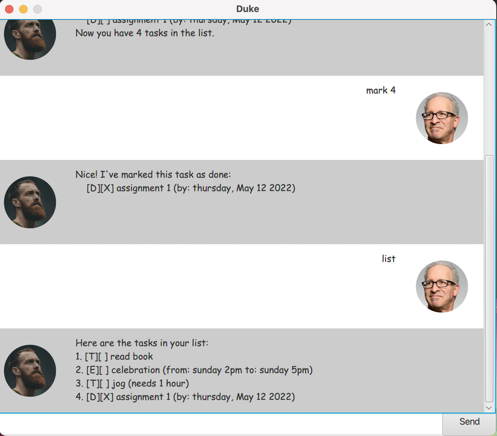

# Duke User Guide

Duke is a desktop task management system to use for your day to day tasks. Manage your work and keep your tasks organized with Duke!

## Table of Contents
1. [Set-Up](#set-up)
2. [Features](#features)
    - [Add Todo task](#add-todo-task)
    - [Add Deadline task](#add-deadline-task)
    - [Add Event task](#add-event-task)
    - [Add Todofor task](#add-todofor-task)
    - [List tasks](#list-tasks)
    - [Find tasks](#find-tasks)
    - [Delete task](#delete-task)
    - [Mark task](#mark-task)
    - [Unmark task](#unmark-task)
    - [Exit](#exit)
    - [Accessing Deleted Data](#accessing-deleted-data)
3. [Summary](#summary)

## Set-Up
1. Ensure you have Java 11 or above installed in your Computer.

2. Download the latest duke.jar from [here](https://github.com/jengoc415/ip/releases).

3. Copy the file to the folder you want to use as the home folder for your duke.

4. Start the app. The GUI similar to the below should appear in a few seconds. Note how the app contains some sample data.

5. Type the command in the command box and press Enter to execute it.
   Some example commands you can try:

    - `list` : Lists all tasks.
    - `mark 1` : Marks Task 1.
    - `delete 3` : Deletes Task 3 shown in the current list.
    - `bye` : Exits the app.

Refer to the [Features](#features) below for details of each command.

## Features
<!-- 
 -->

**Note about the command format:** 

- Command formats are to be followed **strictly**.
   
- `[]` denotes an input given by the user.
  eg. For a deadline, `deadline [Task Name] /by [Date]`, `[Task Name]` and `[Date]` is given by the user which can be `deadline Submit Resume /by 2022-11-11`.
   

- Dates should be in the following format: `YYYY-MM-DD`.
  eg. If a user wants to input 14 September 2022, the corresponding input is `2022-09-14`.
   

- Extraneous parameters for commands that do not take in parameters (such as list, bye and sort) are not allowed.
  e.g. If the command specifies list 123, it will be interpreted as list.

<!-- 
 -->

### Add `Todo` Task

Creates a todo task that tracks a task that has to be completed. 

Format: `todo [Task Name]`

Examples: 

- `todo walk dog`
- `todo watch Avengers Endgame`

### Add `Deadline` Task

Creates a deadline task that tracks a task and the date that it has to be completed by. 

Format: `deadline [Task Name] /by [Date]` 

Tips:

- `[Date]` has to be in the format YYYY-MM-DD.
  eg. If a user wants to input 14 September 2022, the corresponding input is `2022-09-14`.
   
- `/by` should be between the `[Task Name]` and `[Date]` for the input of deadline task to be read correctly.

Examples: 

- `deadline CS2103T IP /by 2022-11-12`
- `deadline Do Resume /by 2022-01-05`

### Add `Event` Task

Creates a event task that tracks a task and the date that it is on. 

Format: `event [Task Name] /from [Start] /to [End]` 

Tips:

- `[Start]` and `[End]` will be interpreted as strings so user can input any strings they want.
   
- `/from` should be between the `[Task Name]` and `[Start]` to be read correctly.
- `/to` should be between the `[Start]` and `[End]` to be read correctly.

Examples: 

- `event Concert /from Sunday 5pm /to Sunday 10pm`
- `event Japan trip /from 1st June 2023 /to 9th June 2023`

### Add `Todofor` Task

Creates a todo task that tracks a task and how duration needed to complete. 

Format: `todofor [Task Name] /for [Duration]` 

Tips:

- `[Duration]` will be interpreted as a string so user can input any strings they want. 
- `/for` should be between the `[Task Name]` and `[Duration]` for the input of event task to be read correctly.

Examples: 

- `todofor read book /for 2 hours`
- `todofor sleep /for forever`

### `List` Tasks

Lists out all the tasks that has been saved in the list.

Format: `list`

Tips:

- List does not take in extraneous inputs. Any such, inputs will be ignored.
   

### `Find` Task

Finds tasks whose Task Name matches the search.

Format: `find [Keyword]`

Tips:

- Find searches by sequence. If a `[Task Name]` contains matching sequence of characters as `[Keyword]` it can be found.
   

### `Delete` Task

Deletes a specified task indexed in the list.

Format: `delete [Index]`

### `Mark` Task

Marks a specified task indexed in the list.

Format: `mark [Index]`

### `Unmark` Task

Unmark a specified task indexed in the list.

Format: `unmark [Index]`

### `Bye` End program

Format: `bye`

- `bye` does not take in extraneous inputs. Any such, inputs will be ignored.

Examples: 
- Input: `bye`
- Output: 'Bye. Hope to see you again soon!'

### Accessing data from previous session

Duke archives data to ensure that you can always retrieve old tasks even after you exit the program!

Data is stored as `tasks.txt` in the same project directory as duke.
If the file is found when Duke is setting up, Duke will load up the previously saved tasks from the get go!
 

## Summary
- **Add Todo:**  `todo [description]`
- **Add Deadline:** `deadline [description] /by [date]`
- **Add Event:** `event [description] /from [start] /to [end]`
- **Add Todofor:** `todofor [description] /for [duration]`
- **Print List:** `list`
- **Find Task:** `find [keyword]`
- **Delete Task:** `delete [index]`
- **Mark Task:** `mark [index]`
- **Unmark Task:** `unmark [index]`
- **Exit:** `bye